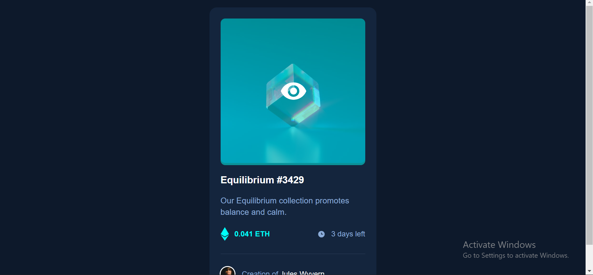

# Frontend Mentor - NFT preview card component solution

This is a solution to the [NFT preview card component challenge on Frontend Mentor](https://www.frontendmentor.io/challenges/nft-preview-card-component-SbdUL_w0U). Frontend Mentor challenges help you improve your coding skills by building realistic projects.

## Table of contents

- [Overview](#overview)
  - [The challenge](#the-challenge)
  - [Screenshot](#screenshot)
  - [Links](#links)
- [My process](#my-process)
  - [Built with](#built-with)
  - [What I learned](#what-i-learned)
  - [Continued development](#continued-development)
  - [Useful resources](#useful-resources)
- [Author](#author)
- [Acknowledgments](#acknowledgments)

## Overview

### The challenge

Users should be able to:

- View the optimal layout depending on their device's screen size
- See hover states for interactive elements

### Screenshot



### Links

- Solution URL: [Add solution URL here](https://github.com/ayeniDan/nft-preview-card-component-main)
- Live Site URL: [Add live site URL here](https://nft-preview-card-component-main-m25wr7chq.vercel.app/)

## My process

### Built with

- Semantic HTML5 markup
- CSS Positioning
- Flexbox
- Psuedo elements
- Psuedo CLasses
- Desktop-first workflow

### What I learned

I learnt a whole lot in this project. I undertstood better the use of positioning in CSS and the use of ::before and ::after.

```css
.images {
	width: 100%;
	position: relative;
}

.images .equil {
	border-radius: 10px;
}

.cover {
	width: 100%;
	height: 100%;
	border-radius: 10px;
	background-color: hsl(178, 100%, 50%);
	position: absolute;
	top: 0;
	left: 0;
	opacity: 0;
	transition: opacity 500ms ease-in-out;
}

.images:hover .cover {
	opacity: 50%;
	cursor: pointer;
}

.eye {
	width: 60px;
	position: absolute;
	top: 40%;
	left: 41%;
	opacity: 0;
	transition: opacity 500ms ease-in-out;
}

.images:hover .eye {
	opacity: 100%;
}
```

### Continued development

- Psuedo elements and classes
- Positioning

### Useful resources

- [Mdn Webdocs](https://developer.mozilla.org/) - This helped me for to understand better the use of Psuedo elements ::after, ::before, :hover and CSS positioning.

# Author

- Frontend Mentor - [@ayeniDan](https://www.frontendmentor.io/profile/ayeniDan)
- Facebook - [Daniel Ayeni](https://web.facebook.com/profile.php?id=61555029605626)
- Linkedin - [Daniel Ayeni](www.linkedin.com/in/daniel-ayeni-718b46307)
